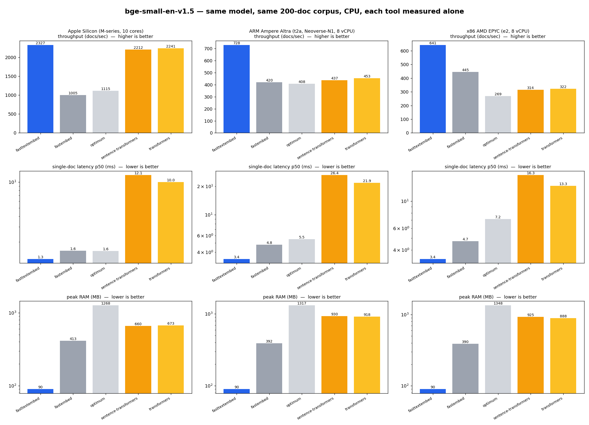

# FastTextEmbed

**Text embedding is the hot path of modern AI.** Agentic and automation systems generate embeddings at
enormous volume — every document chunk for RAG, every memory write, every tool result, every dedup /
search / rerank step — easily **millions to billions of vectors**. At that scale the embedding step
dominates CPU time and the cloud bill, yet most stacks reach for PyTorch or ONNX Runtime, which haul in
**gigabytes of dependencies** and **hundreds of MB to >1 GB of RAM per worker**. Making embedding *fast
and cheap* is therefore one of the highest-leverage cost optimizations an AI system can make.

**FastTextEmbed** is a from-scratch, **pure-C, zero-dependency** engine for `BAAI/bge-small-en-v1.5` that
produces the **same vectors** with the **highest throughput, lowest latency, and lowest memory of any
mainstream tool** — on Apple Silicon, ARM Linux, and x86 AMD. More embeddings per core, **~90 MB of RAM**,
no GPU, no dependencies → a dramatically **more cost-effective** way to run embeddings at scale: pack many
workers per box, fit inside serverless/Lambda limits, and cut the embedding line item on autoscaled agents.

Author: **Cemsina Guzel**

## ⚡ One tiny engine, every language

`fasttextembed` is a ~50 KB C core with **no runtime dependencies** — so it drops into any stack with
near-native speed and ~90 MB of RAM (vs the 400 MB–1.3 GB and gigabytes of dependencies the
PyTorch/ONNX tools pull in). Use it from:

| Language         | Package                     | Install                                               |
| ---------------- | --------------------------- | ----------------------------------------------------- |
| **Python**    | `fasttextembed` (PyPI)      | `pip install fasttextembed`                           |
| **Node / JS** | `fasttextembed` (npm)       | `npm install fasttextembed`                           |
| **Go**        | module                      | `go get github.com/cemsina/fasttextembed/bindings/go` |
| **Rust**      | `fasttextembed` (crates.io) | `cargo add fasttextembed`                             |
| **C**         | static/shared lib + header  | link `libfte`                                         |

Same model (`BAAI/bge-small-en-v1.5`), same 384-dim vectors, every language. The model (~64 MB)
downloads once and is cached; nothing else to install.

## Language bindings

All bindings call the same C engine and download/cache the model on first use. They live under
[`bindings/`](bindings/).

**Python** ([`bindings/python`](bindings/python)) — ctypes, zero runtime deps:

```python
from fasttextembed import TextEmbedding

model = TextEmbedding()                          # model auto-downloads + caches on first use
vectors = model.embed(["hello world", "fast"])   # list of 384-float vectors
```

**Go** ([`bindings/go`](bindings/go)) — cgo, compiles the engine in-tree:

```go
import fte "github.com/cemsina/fasttextembed/bindings/go"

m, _ := fte.New()
defer m.Free()
vecs := m.Embed([]string{"hello world", "fast"}) // [][]float32, 384-dim
```

**Rust** ([`bindings/rust`](bindings/rust)) — `cc`-compiled, safe wrapper, no runtime crates:

```rust
use fasttextembed::TextEmbedding;
let model = TextEmbedding::new()?;
let vecs = model.embed(&["hello world", "fast"]); // Vec<Vec<f32>>
```

**Node / JS** ([`bindings/js`](bindings/js)) — WASM (portable, browser + Node) and an optional native addon:

```js
const { TextEmbedding } = require("fasttextembed");
const m = await TextEmbedding.create();
const vecs = m.embed(["hello world", "fast"]);
```

Each binding sets the model location via `FTE_MODEL_DIR` / `FTE_MODEL_URL` env vars, same as the core.

---

## Benchmark: top embedding tools, same model, same corpus

All tools run **`BAAI/bge-small-en-v1.5`** on **CPU** over the same 200-sentence corpus (`corpus.txt`),
each measured **in its own process** (so memory and speed are isolated, not shared). Three metrics:

- **Throughput** — docs/sec embedding the whole corpus as a batch (uses all cores).
- **Latency** — p50 time to embed a single document (the online/query case).
- **Peak RAM** — maximum resident set size of the process.

**Apple Silicon (M-series, 10 performance cores)** — sorted by throughput:

| Tool                            | Throughput (docs/s) ↑ | Latency p50 (ms) ↓ | Peak RAM (MB) ↓ |
| ------------------------------- | --------------------: | -----------------: | --------------: |
| **fasttextembed (ours)**        |              **2327** |           **1.27** |          **90** |
| sentence-transformers (PyTorch) |                  2229 |              12.08 |             660 |
| transformers (PyTorch)          |                  2205 |              10.02 |             673 |
| optimum (ONNX Runtime)          |                  1125 |               1.57 |            1268 |
| fastembed (ONNX Runtime)        |                   999 |               1.58 |             413 |

**ARM Ubuntu (gcloud `t2a`, Ampere Altra / Neoverse-N1, 8 cores)** — sorted by throughput:

| Tool                            | Throughput (docs/s) ↑ | Latency p50 (ms) ↓ | Peak RAM (MB) ↓ |
| ------------------------------- | --------------------: | -----------------: | --------------: |
| **fasttextembed (ours)**        |               **728** |           **3.39** |          **90** |
| transformers (PyTorch)          |                   453 |              21.86 |             918 |
| sentence-transformers (PyTorch) |                   437 |              26.40 |             930 |
| fastembed (ONNX Runtime)        |                   420 |               4.80 |             392 |
| optimum (ONNX Runtime)          |                   408 |               5.50 |            1317 |

**x86 AMD EPYC (gcloud `e2-standard-8`, 8 vCPU)** — sorted by throughput:

| Tool                            | Throughput (docs/s) ↑ | Latency p50 (ms) ↓ | Peak RAM (MB) ↓ |
| ------------------------------- | --------------------: | -----------------: | --------------: |
| **fasttextembed (ours)**        |               **641** |           **3.38** |          **90** |
| fastembed (ONNX Runtime)        |                   445 |               4.72 |             390 |
| transformers (PyTorch)          |                   322 |              13.31 |             888 |
| sentence-transformers (PyTorch) |                   314 |              16.28 |             925 |
| optimum (ONNX Runtime)          |                   269 |               7.15 |            1348 |

> **fasttextembed has the highest throughput, the lowest latency, and the lowest RAM of all five tools
> on all three machines.** It does it with **~5–14× less RAM** and **~8–20× lower single-doc latency**
> than the PyTorch tools, and **~1.4–2.3× the throughput of ONNX Runtime** everywhere. On Apple Silicon
> it even edges out PyTorch's Accelerate-BLAS batch throughput. (x86 needs an AVX2-capable CPU, i.e.
> essentially every cloud instance since ~2015.)



### Reading the results

- **PyTorch tools (sentence-transformers, transformers)** get strong _batch throughput_ from optimized BLAS, but their _single-document latency_ is ~8–20× worse (Python + framework dispatch per call) and they use **7–14× more RAM**.
- **ONNX Runtime tools (fastembed, optimum)** have good latency but ~half our throughput; optimum is the heaviest on memory (>1.2 GB).
- **fasttextembed** is the only tool that is simultaneously _fast in batch, fast per-query, and tiny in memory_ — and it ships as a single dependency-free C library.

## The problem

Text embedding is the workhorse of modern search and RAG: turn a sentence into a 384-dimensional vector, do it billions of times. The popular tools that run the de-facto standard model `BAAI/bge-small-en-v1.5` all carry heavy machinery:

- **sentence-transformers / transformers** drag in PyTorch (GBs of dependencies, slow per-call dispatch).
- **fastembed** (Qdrant) and **optimum** are lighter but still ship the full, _general-purpose_ ONNX Runtime — an engine built to execute _any_ model graph at runtime.

That generality is overhead. If you only ever run **one** model, almost everything a general engine does — graph parsing, operator dispatch, dynamic shape handling, a multi-MB runtime — is wasted work.

## What we did differently

**Radical specialization.** `fasttextembed` is hardcoded to exactly one model. Its dimensions are compile-time constants (`src/config.h`), its forward pass is straight-line C, and there is **no graph interpreter, no protobuf, no Python, and zero third-party runtime dependencies**. The whole runtime is a few small C files.

What this buys us:

1. **An offline converter** (`tools/convert.py`, runs once) turns the shipped `model_optimized.onnx` into a flat, `mmap`-able weight file (`model.fte`). The runtime just memory-maps it — no parsing at startup.
2. **Hand-written SIMD kernels specialized to this model's fixed shapes** — NEON on ARM, AVX2+F16C on x86 — fp16 weights, register-blocked matmul, fp16 accumulation matching ONNX Runtime's own arithmetic.
3. **Two parallelism modes, chosen per call:** one document per core for bulk throughput, or one document split across cores for low single-query latency — backed by a custom spin-then-block, work-stealing thread pool.
4. **Everything vectorized**, including the "boring" parts (LayerNorm, GELU, bias-add) that general engines vectorize but naive reimplementations leave scalar. _This turned out to be the single biggest win_ (see below).

The result is the **same embeddings** — cosine ≥ 0.9998 vs ONNX Runtime, and in fp32 mode it tracks the original PyTorch model *even more closely than ONNX Runtime itself does* (cosine 0.99999) — at a fraction of the time and memory.

## The journey (what we actually solved)

The interesting part wasn't the first version — it was closing the gap to ONNX Runtime, which is years of Microsoft optimization. We did it empirically, by profiling, and we kept honest notes on what worked and what didn't:

- ✅ **Cache-friendly matmul** ordering: 8 → 68 docs/s.
- ✅ **fp16 weights + NEON widening**: halved memory bandwidth (`model.fte` 133 → 64 MB).
- ✅ **Register blocking** (reuse each weight tile across 4 rows): the bottleneck at short sequence lengths.
- ✅ **Multithreading**: one doc per core (throughput) + intra-doc matmul splitting (latency).
- ❌ **fp16-accumulate lane-FMA** (ONNX Runtime's exact kernel technique): we _ported it and it made us slower_ — its single-accumulator dependency chain stalls, while our simpler kernel keeps more independent chains. Reverted. (Also: we verified ONNX Runtime uses C++ **intrinsics**, not hand assembly, for fp16 on these CPUs — so there was never an assembly wall.)
- ✅ **The decisive fix — vectorizing the elementwise ops.** Profiling showed **24% of per-document time was scalar** LayerNorm / SkipLayerNorm / **GELU** (a scalar `tanhf` called ~180k times per doc). Worse, those ran _serially_ while the matmuls were parallelized, so by Amdahl's law they dominated latency. ONNX Runtime vectorizes them; our first version didn't. Adding vectorized `exp`/`tanh` and reductions (NEON + AVX2) cut that 24% → 4%, and cut single-document latency roughly in half. **This is what finally put us ahead of ONNX Runtime on every metric.**

## How it works

```
text
 → WordPiece tokenizer (pure C)
 → embeddings (word + position + token-type) + LayerNorm
 → 12 × BERT encoder layer:
       fused QKV → multi-head attention → dense → SkipLayerNorm
       FFN (Linear → GELU → Linear) → SkipLayerNorm
 → last_hidden_state[seq, 384]
 → CLS token (row 0) → L2 normalize
 → 384-dim float32 unit vector
```

Everything is specialized to the frozen architecture: 384 hidden, 12 layers, 12 heads, 1536 FFN, vocab 30522, 512 max tokens.

## Build & use

The model is **bundled in the repo** (`model.fte`, `vocab.tsv`) — no Python, no `fastembed`,
no download, no conversion step. You need only a C compiler and CMake:

```bash
cmake -S . -B build && cmake --build build
ctest --test-dir build             # parity + unit tests (run against bundled golden vectors)

# embed text (one doc per stdin line -> 384 floats per line)
echo "hello world" | ./build/fte_cli
```

Public C API (`include/fte/fte.h`): `fte_init`, `fte_embed`, `fte_embed_batch`, `fte_free`.

### Regenerating the model (optional, dev only)

`model.fte`/`vocab.tsv` are checked in, so you never need this. To rebuild them from the
upstream ONNX model (e.g. to target a different model), `tools/convert.py` is the only thing
that needs Python + `fastembed`/`onnx` — it is **not** part of the normal build.

```bash
python3 -m venv .venv && . .venv/bin/activate && pip install onnx fastembed
python tools/convert.py            # rewrites model.fte, vocab.tsv, tests/data/golden_*
```

**Build modes:**

- default: fp16 accumulation, matches ONNX Runtime (cosine ~0.9998), fastest.
- `-DFTE_FP32_ACCUM`: fp32 accumulation, bit-exact (cosine 0.99999).
- `FTE_THREADS=N` env var overrides the intra-doc thread count.

## Reproduce the benchmark

```bash
./build/fte_cli --bench 10 < corpus.txt        # fasttextembed
pip install sentence-transformers transformers torch "optimum[onnxruntime]"
python tools/bench_all.py corpus.txt 10        # the other tools
python tools/plot_results.py                   # regenerate assets/benchmark.png
```

## Status & honest caveats

- ✅ **Fastest of all five tools** — highest throughput, lowest latency, and lowest RAM — on **Apple Silicon, ARM Linux, and x86 AMD**. ~1.4–2.3× ONNX Runtime throughput everywhere.
- ✅ **SIMD on every arch**: NEON (+fp16) on ARM, AVX2+F16C on x86. x86 needs an AVX2-capable CPU (≈every cloud instance since ~2015); older x86 falls back to a correct scalar path.
- ✅ **Bindings (v1.0.0)** for Python, Node/JS (WASM), Go, and Rust — all tested, all returning matching 384-dim vectors.
- ⚠️ Default fp16 mode matches ONNX Runtime at cosine ~0.9998 (identical ranking, not bit-identical); build with `-DFTE_FP32_ACCUM` for bit-exact (cosine 0.99999).
- ⚠️ **Publishing in progress** — packages are being released one platform at a time. Until a release is cut, install from source (the bindings download the model from the `v1.0.0` GitHub release). A JS native (N-API) addon and multi-platform wheel/prebuild CI are the remaining packaging work.
- Scope is deliberately **one model, text only**. That constraint is the whole point.

## Bundled model

`model.fte` is `BAAI/bge-small-en-v1.5` converted from the ONNX weights distributed by Qdrant
(`qdrant/bge-small-en-v1.5-onnx-q`), stored as a flat fp16 binary. The bge-small-en-v1.5 model is
released by BAAI under the **MIT license**; the weights are redistributed here under those terms.

## License

Code: see repository. Bundled model weights: MIT (BAAI/bge-small-en-v1.5).
